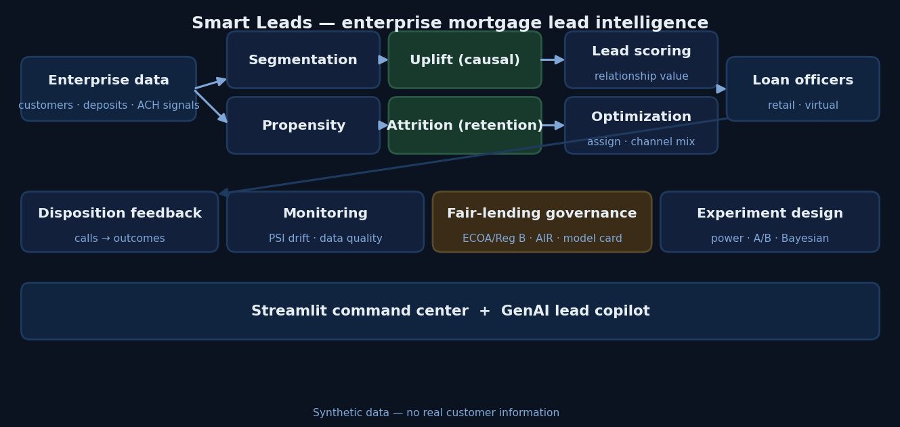
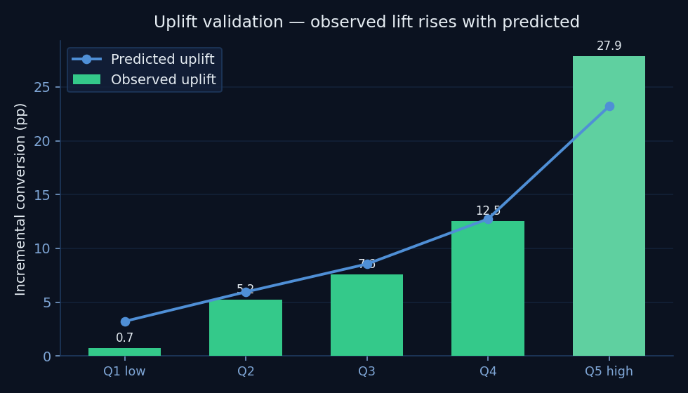
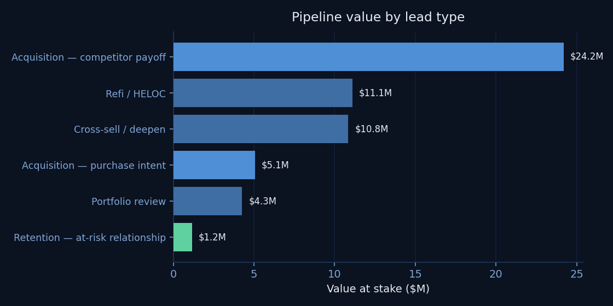

<div align="center">

# 📍 Smart Leads — Mortgage Sales Lead Intelligence

**An end-to-end platform that finds, scores, distributes, and optimizes data-driven
mortgage & home-equity leads for a retail bank — prioritizing the retention and
acquisition of whole customer relationships, not one-off loans.**


</div>

> Portfolio project demonstrating production-grade sales-and-strategy analytics for a
> regulated bank: customer segmentation, propensity & **causal uplift** modeling,
> **relationship-attrition / retention** modeling, optimization, experimental design,
> drift monitoring, **fair-lending governance**, and a GenAI copilot — wired into one
> runnable platform. All data is synthetic; no real customer information is used.

```bash
pip install -r requirements.txt
python -m src.pipeline             # runs the whole platform end-to-end (~25s)
streamlit run app/streamlit_app.py # interactive command center
```

<div align="center">



</div>

---

## Why this is built like a bank, not a mortgage shop

At a monoline lender the loan *is* the relationship, and leads are cold lists. At a bank
the customer is **already inside the house** — deposits, cards, auto, wealth — and a
mortgage is one product in the household. That changes the priority and unlocks
first-party signals a competitor cannot see:

- **Payroll inflow** (a live income signal) and **deposit balances** (capacity & value)
- **Competitor-mortgage detection via ACH** — these customers bank with us but pay a
  *competitor's* mortgage. They are warm acquisition targets.
- **Large deposit inflows** (home-sale proceeds / a down payment being assembled)
- **Home equity** available for HELOC / cash-out

So the platform optimizes, in priority order: **(1) retain** at-risk relationships
(a refi-away is relationship attrition, not just a lost loan), **(2) acquire** by winning
competitor mortgages and purchase-intent prospects, **(3) deepen** the existing book —
all under fair-lending governance and coordinated enterprise contact.

The analytical differentiator is **uplift modeling**: most engines rank by *propensity*
(who is likely to convert), but many likely converters do so anyway, wasting officer
capacity. This platform ranks by **incremental** effect — who converts *because* we
called — and sizes each lead in **relationship dollars at stake**.

---

## Verified results (last pipeline run)

<table>
<tr><td width="50%" valign="top">



</td><td width="50%" valign="top">



</td></tr>
</table>

- **Uplift recovers ground truth:** observed incremental conversion rises monotonically
  **0.7pp → 27.9pp** across predicted-uplift buckets (uplift AUC validated against a
  known, baked-in heterogeneous treatment effect).
- **Retention model:** attrition AUC **0.71** over a ~10% base rate, surfacing the
  highest-value households about to refinance away.
- **Optimized distribution:** 1,500 leads routed to 39 officers at **94% capacity
  utilization**, ~**$4.0M** expected production; **$56.6M** total pipeline value at stake.
- **Fair-lending audit passes:** minimum Adverse Impact Ratio **0.94** (clears the 80%
  rule); `age` excluded from every model; proxy-leakage AUC 0.59.
- **Self-validating:** all data-quality checks pass; population drift PSI < 0.01.

_(Numbers regenerate on every run; see `reports/run_summary.json` and `reports/MODEL_CARD.md`.)_

---

## What's inside

| Module | What it does |
|---|---|
| `src/data_generation.py` | Synthetic enterprise bank book with a **known heterogeneous treatment effect** + attrition, so causal results are verifiable. |
| `src/features.py` | Single analytic base table / feature store; **excludes `age`** (ECOA-protected) from all models by construction. |
| `src/segmentation.py` | KMeans segmentation (k by silhouette) → bank personas + recommended plays. |
| `src/propensity.py` | Calibrated gradient-boosted P(convert \| contacted) + decile-lift table. |
| `src/uplift.py` | **T-learner causal uplift** + Qini / decile validation. |
| `src/retention.py` | **Attrition model** — refi-away risk on serviced mortgages; drives retention leads. |
| `src/lead_scoring.py` | Fuses uplift × **relationship value** × timing into a tiered priority score + rationale. |
| `src/optimization.py` | **PuLP linear programs**: lead→officer assignment under capacity/channel/region; channel-mix optimization. |
| `src/disposition.py` | Call-disposition funnel + production validation of the score. |
| `src/experiment.py` | Power analysis, two-proportion z-test, Bayesian read. |
| `src/monitoring.py` | PSI drift detection + automated data-quality assertions. |
| `src/governance.py` | **Fair-lending audit** (Adverse Impact Ratio), proxy-leakage check, contact governance, model card. |
| `src/copilot.py` | GenAI next-best-action call briefs (Claude API; graceful offline fallback). |
| `src/pipeline.py` | One command runs all of the above. |
| `app/streamlit_app.py` | Interactive manager + loan-officer command center. |

---

## How this maps to the Principal Data Scientist — Mortgage Sales & Strategy role

| Job responsibility | Where it lives |
|---|---|
| Customer segmentation analyses & scoping | `segmentation.py` |
| Engineer data-driven **retention & acquisition** leads | `propensity.py`, `retention.py`, `lead_scoring.py` |
| Optimize lead distribution across Virtual/Retail officers | `optimization.py` (assignment LP) |
| Optimal number & mix of leads across channels | `optimization.py` (channel mix) |
| Lead scoring/prioritization within a strategy framework | `lead_scoring.py`, `uplift.py` |
| Manage & analyze call disposition data | `disposition.py` |
| Experimental design | `experiment.py` |
| Automate data flows, monitoring & QC | `monitoring.py`, `Makefile`, CI |
| Communicate insights to non-technical audiences | `copilot.py`, Streamlit app, `analysis/` |
| Continuously innovate (new techniques) | causal uplift, attrition modeling, GenAI copilot |
| **Operate under bank governance** | `governance.py` (ECOA/Reg B, SR 11-7, fair lending) |

---

## Fair lending & model governance

A bank that proactively solicits customers for credit operates under **ECOA / Regulation B**
and fair-lending scrutiny — *who* you choose to market to can create disparate impact even
with no protected attribute as a feature. The platform bakes in the controls a model-risk
(SR 11-7) and fair-lending review expects:

- **Protected-attribute exclusion** — `age` is excluded from every feature set, verified in tests.
- **Disparate-impact testing** — Adverse Impact Ratio (the 80% rule) on lead selection, by
  demographic proxy and by age band.
- **Proxy-leakage check** — can features reconstruct the protected proxy? (lower AUC is better)
- **Contact governance** — one active solicitation per household, weekly volume capped.
- **Model card** — auto-generated at `reports/MODEL_CARD.md`.

---

## Run individual components

```bash
python -m src.segmentation   # segment profiles + recommended plays
python -m src.propensity     # AUC, decile lift, feature drivers
python -m src.uplift         # uplift validation (recovers the true effect)
python -m src.retention      # attrition model + top at-risk relationships
python -m src.lead_scoring   # tiered priority leads + rationale
python -m src.optimization   # assignment + channel mix
python -m src.disposition    # disposition funnel + score validation
python -m src.experiment     # power analysis + A/B evaluation
python -m src.monitoring     # data quality + PSI drift
python -m src.governance     # fair-lending audit + model card
python -m src.copilot        # GenAI call brief for the top lead
```

## Notes

- Models use scikit-learn's gradient boosting for portability; swap in LightGBM/XGBoost
  (same interface) for production.
- The GenAI copilot calls the Anthropic API when `ANTHROPIC_API_KEY` is set, and falls
  back to a deterministic template otherwise — the repo is fully functional offline.
- Synthetic data only; production use would require real outcome data, a randomized
  holdout to keep the causal estimate honest, and a formal fair-lending review.

---

<div align="center">
<sub>Author: Richard K. Henderson · Lead Data Scientist · synthetic data, no real customer information</sub>
</div>
